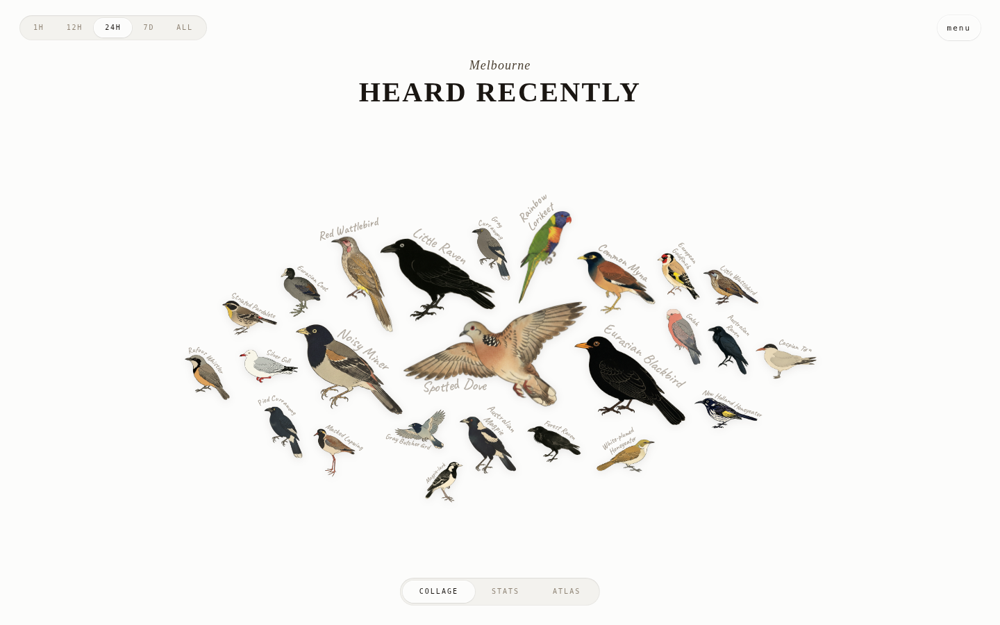

# melb-avian-visitors

A live collage of the birds heard around one window, viewable on any device.
Melbourne-flavoured: Australian illustrations, `Australia/Melbourne` day
boundaries, and Wikipedia descriptions slanted to what a bird is doing *here*
rather than where it came from.

Forked from [AvianVisitors](https://github.com/Twarner491/AvianVisitors) and
rebuilt for the southern hemisphere — and, more usefully, for people **without
a microphone on the windowsill**. Upstream needs a BirdNET-Pi on your own
network, PHP, SQLite and a tunnel into your house. This reads
[BirdWeather](https://app.birdweather.com)'s public API instead, so the whole
thing is one Cloudflare Worker and a folder of static files.

You can run it today against public stations near you, and point it at your own
microphone later by changing one config value.



## How it works

```
a mic ──►  BirdWeather  ──►  this Worker (cached)  ──►  forked frontend
```

The Worker serves AvianVisitors' `birdnet-api.php` contract out of BirdWeather's
GraphQL API, so the frontend runs unmodified with no Pi, no PHP, no SQLite and
nothing exposed on anyone's network. If the microphone falls over, the site
degrades to the neighbourhood view and keeps working.

Two stages:

- **Stage one — no hardware at all.** Point `STATION_IDS` at a cluster of public
  BirdWeather stations near you. The site works immediately, showing what the
  neighbourhood is hearing.
- **Stage two — your own mic.** Register a BirdNET-Pi or BirdNET-Go station,
  set `OWN_STATION_ID`, redeploy. Every view narrows from the neighbourhood to
  your own back yard. Nothing else moves.

The committed config ships with a working six-station cluster in inner
Melbourne so you can see it running before changing anything. Replace those ids
with stations near you — [the station list](https://app.birdweather.com/stations)
gives you the number at the end of each station's URL.

## What's here

- [`worker/`](worker/) — the BirdWeather shim, and [its README](worker/README.md)
  for the two undocumented upstream landmines that cost real debugging time
- [`web/`](web/) — the forked frontend
- [`tools/`](tools/) — spike scripts and the art pipeline
- [`PLAN.md`](PLAN.md) — architecture, phasing, costs, risks
- [`docs/SPIKE.md`](docs/SPIKE.md) — **the measured findings**: why BirdNET
  *confidence* is the wrong quality knob and BirdWeather *score* is the right one
- [`docs/DEPLOY.md`](docs/DEPLOY.md) — putting it on Cloudflare
- [`docs/HARDWARE.md`](docs/HARDWARE.md) — the microphone, four price tiers
- [`docs/ART-SOURCES.md`](docs/ART-SOURCES.md) — what Australian bird art already exists
- [`docs/UPSTREAM-NOTES.md`](docs/UPSTREAM-NOTES.md) — the layout parameters upstream already tuned
- [`docs/FUTURE.md`](docs/FUTURE.md) — features considered and deliberately not built

## Running it

Everything runs from the repository root — the worker's own `package.json`
lives in `worker/`, and the root scripts delegate to it so you never have to
remember which directory you are in.

```bash
npm run install:worker   # once
npm test                 # unit tests
npm run live             # 31 checks against the live stations in wrangler.toml
npm run dev              # the whole site at http://localhost:8787
npm run deploy           # to Cloudflare
```

`npm run live` hits the real BirdWeather API and needs no account. If it prints
real birds with recent timestamps, everything downstream of it is a Cloudflare
problem, not a data one.

Art pipeline, also from the root (needs Python 3 and a paid Gemini key — see
[`tools/art/`](tools/art/)):

```bash
npm run art:generate     # only the species with no illustration
npm run art:cutout       # strip the cream ground
npm run art:verify       # detached fragments, clipped edges
npm run art:masks        # rebuild dims.json + masks.json
```

## Scope

This is a **snapshot of a working personal project**, published because the
BirdWeather-instead-of-BirdNET-Pi approach is genuinely reusable and nobody
else seems to have written it down. It is not actively maintained, and issues
and pull requests are unlikely to get a response. Fork it freely.

Licence: CC-BY-NC-SA-4.0, inherited from BirdNET-Pi via AvianVisitors. See
[`NOTICE`](NOTICE) for who made what.
